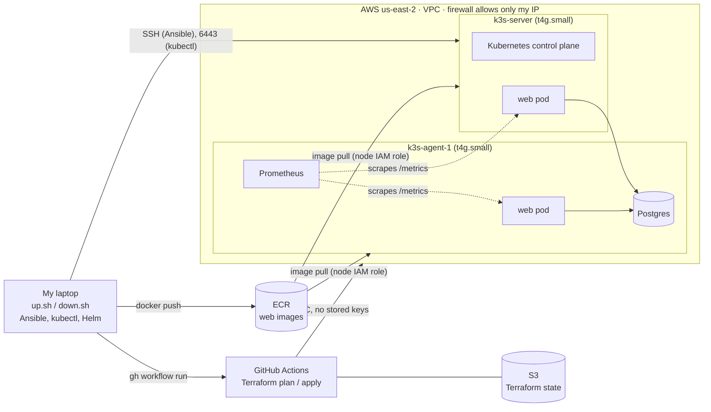

# cluster-week

A small Kubernetes platform on AWS that I build up and tear down for each work session. It runs a tiny web app with a database, and I used it to find and fix a real reliability bug: a readiness check that lied.

## What it is

- **Infrastructure as code.** Terraform creates a VPC, a firewall that only lets my IP in, an image registry (ECR) and two ARM servers (t4g.small, Ubuntu 24.04). Terraform only runs in GitHub Actions and logs in to AWS with short-lived OIDC credentials, so no AWS keys are stored in GitHub. Pull requests get a `terraform plan`, and merges to `main` get an `apply`.
- **Configuration management.** An Ansible playbook hardens the servers, installs k3s (a lightweight Kubernetes), joins the second server to the first, and sets up a timer that refreshes the registry login every six hours. Running it twice reports `changed=0`.
- **The app.** A Flask API backed by Postgres, packaged as a non-root, two-stage Docker image tagged with the git commit hash.
- **Observability.** Prometheus (kube-prometheus-stack) scrapes the app's `/metrics` and has two alerts: a high error ratio, and no ready web pods.
- **Chaos test.** A NetworkPolicy cuts one pod off from the database while a load pod measures what users would see.

## Diagram



Pods are spread across both servers by the scheduler, so where each pod lands can vary between runs.

## How to run it

You need AWS credentials (`aws login`), the GitHub CLI logged in, Docker, kubectl, Helm, jq and Ansible. Your SSH key must be unlocked first (`ssh-add --apple-use-keychain ~/.ssh/id_ed25519`).

```bash
scripts/up.sh                          # two servers + k3s, prints the nodes
image=$(scripts/push.sh)               # build and push the app image
scripts/deploy.sh "$image"             # Postgres + two web pods
scripts/monitoring.sh                  # Prometheus, scrape config, alerts
scripts/cut.sh before                  # the experiment (writes docs/evidence/before.md)
scripts/db-outage.sh                   # the alert test (appends to docs/evidence/after.md)
scripts/down.sh                        # delete the servers and confirm none are left
```

Always finish with `scripts/down.sh`. [docs/scripts.md](docs/scripts.md) explains every script step by step, and [docs/what-happened.md](docs/what-happened.md) is the build log.

## What broke, how I found it, and how I fixed it

**The bug.** The web app has a readiness probe, which Kubernetes calls every 5 seconds to decide whether a pod should receive traffic. `/readyz` returned "ok" without checking anything.

**How I found it.** I cut one of the two web pods off from the database with a NetworkPolicy, while a load pod called the API twice a second ([before.md](docs/evidence/before.md)):

| | Before the fix | After the fix |
|---|---|---|
| Cut pod marked not ready | never (Ready for all 61 s) | after **6 s** |
| Failed requests after the cut | **58 of 121** (about half) | **3 of 74**, then none |
| Last 30 seconds | still about half failing | **60 of 60** succeeded |
| Endpoint slice | both pods `ready=true` | cut pod `ready=false` |

Before the fix, Kubernetes kept sending every other request to a pod that couldn't do its job, because the probe said everything was fine.

**The fix.** `/readyz` now opens a real database connection with a two-second timeout and returns 503 if it can't ([code](app/app.py)). With the probe settings (every 5 s, 3 s timeout, 2 failures), a broken pod is pulled out of rotation in about 5–15 seconds. I rolled it out with `kubectl set image` and repeated the experiment ([after.md](docs/evidence/after.md)).

**The alert.** When I scaled Postgres to zero, both pods correctly went not ready, and Prometheus fired `WebNoReadyPods` within a minute. A total outage now pages someone instead of failing silently.

## What it costs

Everything is torn down after each session, so the cost is per hour of use:

| Item | Per hour |
|---|---|
| 2 × t4g.small (us-east-2, on demand) | $0.034 |
| 2 × public IPv4 address | $0.010 |
| 2 × 20 GB gp3 disk | $0.004 |
| **Total while running** | **about $0.05** |

While nothing is running, the ECR images, the Terraform state in S3 and GitHub Actions cost a few cents a month or nothing. The whole build, including about 2.5 hours of cluster time, cost roughly $0.13.

## Repo layout

```text
infra/        Terraform: network, firewall, IAM, ECR, servers, GitHub OIDC role
.github/      The Terraform pipeline
ansible/      Server setup and k3s install
app/          Flask app and Dockerfile
k8s/          Namespace, Postgres, web app, load pod, chaos NetworkPolicy
monitoring/   Helm values, ServiceMonitor, alert rules
scripts/      Session, build, deploy, monitoring and experiment scripts
docs/         Build log, script guide, before/after evidence
```
